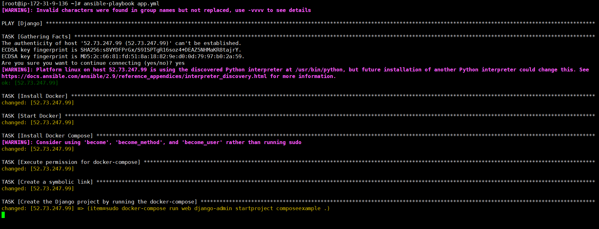
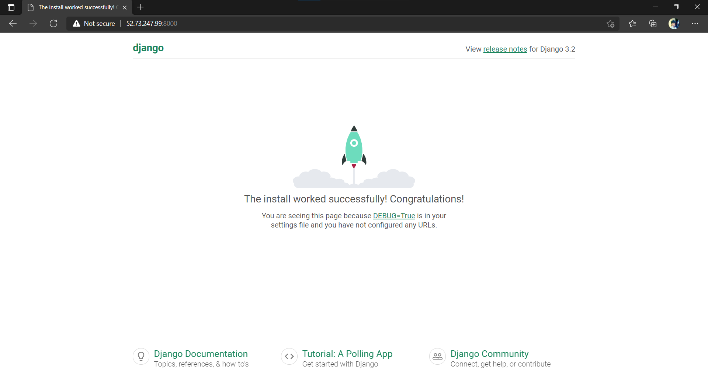
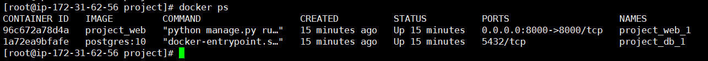

# Django-PostgreSQL-application
Docker Compose to set up and run Django/PostgreSQL app using Ansible playbook.

<h1 class="code-line" data-line-start=0 data-line-end=1 >Objective: To use Docker Compose to set up and run a Django/PostgreSQL app.</h1>

<h2 class="code-line" data-line-start=3 data-line-end=4 >Description:</h2>

Create a docker-compose file for running a django application with postgresql 10. Django app and postgresql should be running as different compose services. Also the compose app should be deployed using ansible playbook

<h1 class="code-line" data-line-start=6 data-line-end=7 ><strong><em>Details of the Task:</em></strong></h1>
<h2 class="code-line" data-line-start=8 data-line-end=9 >Version:</h2>

<strong><em>Docker</em></strong> 
[root@ip-172-31-62-56 project]# docker --version 
Docker version 20.10.4, build d3cb89e 
<strong><em>postgres</em></strong> 
root@1a72ea9bfafe:/# postgres -V 
postgres (PostgreSQL) 10.17 (Debian 10.17-1.pgdg90+1) 
<strong><em>docker-compose</em></strong> 
[root@ip-172-31-62-56 project]# docker-compose --version 
docker-compose version 1.29.2, build 5becea4c

<h2 class="code-line" data-line-start=19 data-line-end=20 >File Locations:</h2>

[root@ip-172-31-48-248 project]# pwd 
/root/project 
[root@ip-172-31-48-248 project]# tree 
. 
├── docker-compose.yml 
├── Dockerfile 
└── requirements.txt

0 directories, 3 files

<h2 class="code-line" data-line-start=31 data-line-end=32 >Successfull Outputs:</h2>
<h4 class="code-line" data-line-start=33 data-line-end=34 ><strong><em>Output of the Django app running on port 8000</em></strong></h4>

<h4 class="code-line" data-line-start=37 data-line-end=38 ><strong><em>Output of Ansible playbook-app.yml</em></strong></h4>

<h4 class="code-line" data-line-start=41 data-line-end=42 ><strong><em>Output of running containers</em></strong></h4>

<strong>Thank you</strong>

