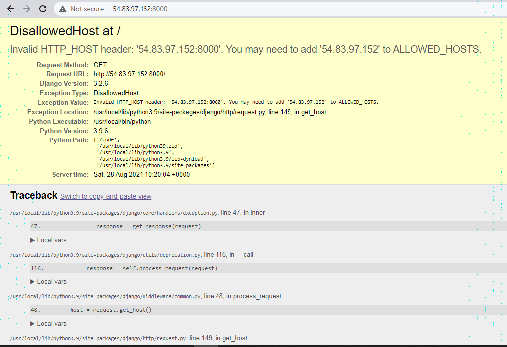
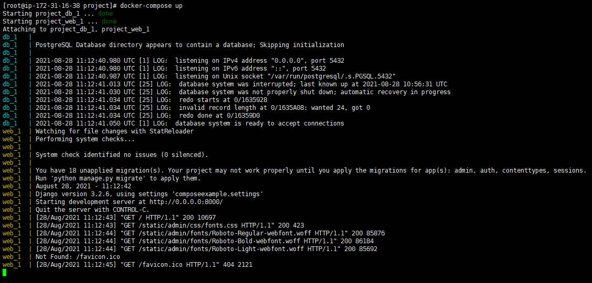

# Django-PostgreSQL-application

<h2 class="code-line" data-line-start=0 data-line-end=1 >Objective:</h2>

To set up and run a Django/PostgreSQL application using Docker Compose and Ansible playbook.

<h2 class="code-line" data-line-start=4 data-line-end=5 >Description:</h2>

Create a docker-compose file for running a Django application with PostgreSQL 10. The Django app and PostgreSQL should be running as different compose services. Also, the compose app should be deployed using an ansible-playbook. I have used two Amazon Linux EC2 instances, one for the Django/PostgreSQL application and the other one used as an Ansible server.

<h2 class="code-line" data-line-start=8 data-line-end=9 >Requirements:</h2>
<ul>
<li class="has-line-data" data-line-start="10" data-line-end="11">Dockerfile</li>
<li class="has-line-data" data-line-start="11" data-line-end="12">Ansible playbook</li>
<li class="has-line-data" data-line-start="12" data-line-end="13">Docker-compose file</li>
<li class="has-line-data" data-line-start="13" data-line-end="15">Requirements.txt file</li>
</ul>
<h2 class="code-line" data-line-start=15 data-line-end=16 >Steps:</h2>
<h3 class="code-line" data-line-start=16 data-line-end=17 >Define the project components:</h3>
<ol>
<li class="has-line-data" data-line-start="17" data-line-end="18">We need to create an empty project directory.</li>
<li class="has-line-data" data-line-start="18" data-line-end="19">Create a new file called Dockerfile in the project directory.</li>
<li class="has-line-data" data-line-start="19" data-line-end="21">Add the content to the Dockerfile. 
The Dockerfile starts with a Python 3 parent image. The parent image is modified by adding a new code directory. The parent image is further modified by installing the Python requirements defined in the requirements.txt file.</li>
<li class="has-line-data" data-line-start="21" data-line-end="23">Create a requirements.txt in the project directory. 
This file is used by the RUN “pip install -r requirements.txt” command in the Dockerfile.</li>
<li class="has-line-data" data-line-start="23" data-line-end="24">Add the required software to the file.</li>
</ol>
<pre><code class="has-line-data" data-line-start="25" data-line-end="28" class="language-sh">Django&gt;=3.0,&lt;4.0
psycopg2-binary&gt;=2.8
</code></pre>
<ol start="6">
<li class="has-line-data" data-line-start="28" data-line-end="31">Create a file called docker-compose.yml in the project directory. 
The docker-compose.yml file describes the services that make the app. In our case, the “web” and “DB” services are web server and database respectively. The compose file also describes which Docker images these services use, how they link together, any volumes they might need to be mounted inside the containers. Finally, the docker-compose.yml file describes which ports these services expose.</li>
</ol>
<pre><code class="has-line-data" data-line-start="32" data-line-end="42" class="language-sh">[root@ip-172-31-48-248 project]# pwd
/root/project
[root@ip-172-31-48-248 project]# tree

├── docker-compose.yml
├── Dockerfile
└── requirements.txt

0 directories, 3 files
</code></pre>
<ol start="7">
<li class="has-line-data" data-line-start="43" data-line-end="44">Run the ansible-playbook “app.yml”</li>
</ol>
<pre><code class="has-line-data" data-line-start="45" data-line-end="47" class="language-sh">ansible-playbook app.yml
</code></pre>
<ol start="8">
<li class="has-line-data" data-line-start="47" data-line-end="48">After the tasks have been completed, list the contents of the project. You can see that there will be new files created within the project directory.</li>
</ol>
<pre><code class="has-line-data" data-line-start="49" data-line-end="59" class="language-sh">[root@ip-172-31-16-38 project]# ll
total 16
drwxr-xr-x 3 root root 108 Aug 28 10:19 composeexample
drwxr-xr-x 3 root root  16 Aug 28 10:19 data
-rw-r--r-- 1 root root   0 Aug 28 10:19 db.sqlite3
-rw-r--r-- 1 root root 386 Aug 28 09:50 docker-compose.yml
-rw-r--r-- 1 root root 131 Aug 28 09:49 Dockerfile
-rwxr-xr-x 1 root root 670 Aug 28 10:19 manage.py
-rw-r--r-- 1 root root  38 Aug 28 09:51 requirements.txt
</code></pre>

If you are running Docker on Linux, the files Django-admin created are owned by root. This happens because the container runs as the root user. Change the ownership of the new files.

<pre><code class="has-line-data" data-line-start="61" data-line-end="63" class="language-sh">sudo chown -R $USER:$USER .
</code></pre>
<h3 class="code-line" data-line-start=63 data-line-end=64 >Connect the database</h3>

In this section, you set up the database connection for Django.

<ul>
<li class="has-line-data" data-line-start="66" data-line-end="69">In the project directory, edit the composeexample/settings.py file. 
Replace the DATABASES = … with the following:</li>
</ul>
<h3 class="code-line" data-line-start=69 data-line-end=70 ><a href="http://settings.py">settings.py</a></h3>
<pre><code class="has-line-data" data-line-start="72" data-line-end="83" class="language-sh">DATABASES = {
    'default': {
        'ENGINE': 'django.db.backends.postgresql',
        'NAME': 'postgres',
        'USER': 'postgres',
        'PASSWORD': 'postgres',
        'HOST': 'db',
        'PORT': 5432,
    }
}
</code></pre>

These settings are determined by the Postgres Docker image specified in docker-compose.yml.

<ul>
<li class="has-line-data" data-line-start="85" data-line-end="89">You need to edit ALLOWED_HOSTS inside <a href="http://settings.py">settings.py</a> and add the IP address to the list 
ALLOWED_HOSTS = [‘IP’] 
<strong>Note:</strong> If you didn’t specify any value to the ALLOWED_HOSTS parameter on the &quot;<a href="http://settings.py">settings.py</a>&quot; file, you will get the below-mentioned error;</li>
</ul>

<ol start="9">
<li class="has-line-data" data-line-start="91" data-line-end="92">Run the docker-compose-up command from the top-level directory for the project.</li>
</ol>
<pre><code class="has-line-data" data-line-start="93" data-line-end="96" class="language-sh">[root@ip-172-31-16-38 ~]# cd project/
[root@ip-172-31-16-38 project]# docker-compose up
</code></pre>

At this point, the Django app should be running at port 8000 and to see the Django welcome page use the below URL. 
http://ip_address:8000/

<strong>Note:</strong> You need to open the ports 8000 and 5432 in the Security group for the EC2 Instance.

<h2 class="code-line" data-line-start=104 data-line-end=105 >Versions:</h2>
<ol>
<li class="has-line-data" data-line-start="105" data-line-end="106">Docker</li>
</ol>
<pre><code class="has-line-data" data-line-start="107" data-line-end="110" class="language-sh"> [root@ip-172-31-62-56 project]# docker --version
Docker version 20.10.4, build d3cb89e
</code></pre>
<ol start="2">
<li class="has-line-data" data-line-start="110" data-line-end="111">PostgreSQL</li>
</ol>
<pre><code class="has-line-data" data-line-start="112" data-line-end="115" class="language-sh">root@1a72ea9bfafe:/# postgres -V
postgres (PostgreSQL) 10.17 (Debian 10.17-1.pgdg90+1)
</code></pre>
<ol start="3">
<li class="has-line-data" data-line-start="115" data-line-end="116">Docker-compose</li>
</ol>
<pre><code class="has-line-data" data-line-start="117" data-line-end="120" class="language-sh">[root@ip-172-31-62-56 project]# docker-compose --version
docker-compose version 1.29.2, build 5becea4c
</code></pre>
<ol start="4">
<li class="has-line-data" data-line-start="120" data-line-end="121">Python</li>
</ol>
<pre><code class="has-line-data" data-line-start="122" data-line-end="125" class="language-sh">[root@ip-172-31-62-56 project]# python -V
Python 3.8.0
</code></pre>
<h2 class="code-line" data-line-start=126 data-line-end=127 >Outputs:</h2>

<strong><em>Output of Ansible playbook app.yml</em></strong> 

<strong><em>Output of the Django app running on port 8000</em></strong> 

<strong><em>Output of running containers</em></strong> 

<h2 class="code-line" data-line-start=137 data-line-end=138 >Additional links:</h2>
<table class="table table-striped table-bordered">
<thead>
<tr>
<th>Tools</th>
<th>Links</th>
</tr>
</thead>
<tbody>
<tr>
<td>Docker-compose</td>
<td><a href="https://docs.docker.com/compose/">https://docs.docker.com/compose/</a></td>
</tr>
<tr>
<td>Django(framework)</td>
<td><a href="https://www.djangoproject.com/">https://www.djangoproject.com/</a></td>
</tr>
<tr>
<td>Ansible</td>
<td><a href="https://docs.ansible.com/">https://docs.ansible.com/</a></td>
</tr>
<tr>
<td>PostgreSQL</td>
<td><a href="https://www.postgresql.org/docs/">https://www.postgresql.org/docs/</a></td>
</tr>
</tbody>
</table>
<h2 class="code-line" data-line-start=146 data-line-end=147 >Summary</h2>

I hope this will help you in working with Docker, Django, PostgreSQL, and Ansible.

<h2 class="code-line" data-line-start=149 data-line-end=150 ><strong>Thank You</strong></h2>
